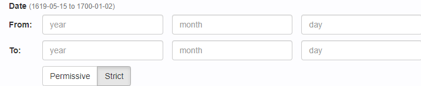
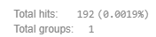

# BlackLab Frontend

- **[About](#about)**
    - [Intro](#intro)
    - [Basic usage](#how-to-use)
- **[Installation](#installation)**
    - [Requirements](#requirements)
    - [Releases](#download-a-release)
    - [Building from source](#building-from-source)
    - [Using Docker](#using-docker)
- **[Configuration](#configuration)**
    - [Backend configuration](#backend-configuration)
    - [Adding corpora](#adding-corpora)
    - [User corpora](#allowing-users-to-add-corpora)
    - [Customizing the Frontend (Frontend configuration)](#customizing-the-frontend)
        - [Custom JS](#custom-js)
        - [Custom CSS](#custom-css)
- **[Development](#development)**
    - [Frontend Javascript](#frontend-javascript)
      - [Application structure](#application-structure)
      - [The Vuex store](#the-vuex-store)
      - [URL generation and parsing](#url-generation-and-parsing)
      - [Development tips](#development-tips)
    - [Backend development](#backend-development)


About
===================


## Intro

This is a corpus search application that works with [BlackLab Server](https://github.com/INL/BlackLab/).
At the Dutch Language Institute, we use it to publish our corpora such as [CHN](https://chn.ivdnt.org/) (CLARIN login required), [Letters as Loot](https://brievenalsbuit.ivdnt.org/) and [AutoSearch](https://portal.clarin.inl.nl/autocorp/) (CLARIN login required).


## How to use

Help is contained in the application in the form of a _page guide_ that can be opened by clicking the button on the right of the page.


Installation
===================

## Requirements

- Java 1.8
- A java servlet container such as [Apache Tomcat](https://tomcat.apache.org/).
Use Tomcat 7 version `7.0.76` or newer or Tomcat 8 version `8.0.42` or newer. Using older versions will cause some [warnings from dependencies](https://bz.apache.org/bugzilla/show_bug.cgi?id=60688).
- An instance of [BlackLab-Server](https://github.com/INL/BlackLab/).
While we do our best to make the frontend work with older versions of BlackLab, use a matching version of BlackLab (so `corpus-frontend v2.0` with `blacklab-server v2.0`).

## Download a release

Releases can be downloaded [here](https://github.com/INL/corpus-frontend/releases).

## Building from source

- Clone this repository, use `mvn package` to build the WAR file (or download the .war from the latest release) and add corpus-frontend.war to Tomcat's webapps directory.
- Optionally, create a file `corpus-frontend.properties` (name must be the same as the .war file) in the same directory as the BlackLab Server config file (e.g. `/etc/blacklab/`).
See the [Configuration section](#Backend-configuration) for more information.
- Navigate to `http://localhost:8080/corpus-frontend/` and you will see a list of available corpora you can search.

For further development and debugging help, see the [Development section](#Development).

## Using Docker

Make sure you [enable BuildKit](https://docs.docker.com/build/buildkit/#getting-started) 
(e.g. `export DOCKER_BUILDKIT=1`) before building the image.

To create a container with BlackLab Frontend and Server, run:

```bash
docker-compose up --build 
```

The config file `./docker/config/corpus-frontend.properties` will be mounted inside the container. 
(if you need to change some settings, you can set the `CONFIG_PATH` environment variable to read
`corpus-frontend.properties` from a different directory).

If you have an indexed BlackLab corpus that you want to access, you can set `CORPUS_DIR` to 
this directory and `CORPUS_NAME` to the name this corpus should have, e.g.:

```bash
CORPUS_DIR="/tmp/mycorpus" CORPUS_NAME="my-awesome-corpus" docker-compose up --build
```

See next section for how to configure BlackLab Frontend.

Configuration
====================


## Backend configuration

To configure the corpus-frontend, create a file `corpus-frontend.properties` (_see note on naming_) in any of the following directories (in descending order of priority):
- `CORPUS_FRONTEND_CONFIG_DIR` Environment variable
- `AUTOSEARCH_CONFIG_DIR` Environment variable
- `BLACKLAB_CONFIG_DIR` Environment variable
- (on unix) `/etc`, `/etc/blacklab`, `/vol1/etc/blacklab` (to mirror BlackLab's default locations)
- in the same directory as the `.war` file
- in the home dir (`~` on linux, `%userdir%` on windows)

> **NOTE:** the filename must match the name of your `.war`, but ending in `.properties`!  
If you deployed `corpus-frontend-test.war`, your config should then be named `corpus-frontend-test.properties`

Example file and defaults:

```properties

# The url under which the back-end can reach blacklab-server.
# Separate from the front-end to allow connections for proxy situations
#  where the paths or ports may differ internally and externally.
blsUrl=http://localhost:8080/blacklab-server/

# The url under which the client can reach blacklab-server.
blsUrlExternal=/blacklab-server/

# The url under which the client can reach the corpus-frontend.
# May be needed if the corpus-frontend is proxied under a different path.
# It defaults to the contextPath of the servlet, so it might not strictly be 'corpus-frontend', depending on your deployment.
cfUrlExternal=/corpus-frontend/

# Optional directory where you can place files to further configure and customize
#  the interface on a per-corpus basis.
# Files should be placed in a directory with the name of your corpus, e.g. files
#  for a corpus 'MyCorpus' should be placed under 'corporaInterfaceDataDir/MyCorpus/'.
corporaInterfaceDataDir=/etc/blacklab/projectconfigs/

# Optional directory for default/fallback settings across all your corpora.
# The name of a directory directly under the corpusInterfaceDataDir.
# Files such as the help and about page will be loaded from here
#  if they are not configured/available for a corpus.
# If this directory does not exist or is not configured,
#  we'll use internal fallback files for all essential data.
corporaInterfaceDefault=default

# Path to frontend javascript files (can be configured to aid development, e.g.
#  loading from an external server so the java web server does not need
#  to constantly reload, and hot-reloading/refreshing of javascript can be used).
jspath=/corpus-frontend/js

# An optional banner message that shows above the navbar.
#  It can be hidden by the user by clicking an embedded button, and stores a cookie to keep it hidden for a week.
#  A new banner message will require the user to explicitly hide it again.
# Simply remove this property to disable the banner.
bannerMessage=<span class="fa fa-exclamation-triangle"></span> Configure this however you see fit, HTML is allowed here!

# Disable xslt and search.xml caching, useful during development.
cache=true

# Show or hide the debug info checkbox in the settings menu on the search page.
# N.B. The debug checkbox will always be visible when using webpack-dev-server during development.
# It can also be toggled by calling `debug.show()` and `debug.hide()` in the browser console.
debugInfo=false

# Set the "withCredentials" option for all ajax requests made from the client to the (blacklab/frontend)-server. 
# Passes authentication cookies to blacklab-server.
# This may be required if your server is configured to use authentication.
# NOTE: this only works if the frontend and backend are hosted on the same domain, or when the server does not pass "*" for the Access-Control-Allow-Origin header. 
withCredentials=false

```


## Adding corpora

Corpora may be [added manually](https://inl.github.io/BlackLab/guide/indexing-with-blacklab.html) or [uploaded by users](#allowing-users-to-add-corpora) (if configured).

After a corpus has been added, the corpus-frontend will automatically detect it, a restart should not be required.


## Allowing users to add corpora

### Configuring BlackLab

To allow this, BlackLab needs to be configured properly (user support needs to be enabled and user directories need to be configured).
See [the BlackLab documentation](https://inl.github.io/BlackLab/server/howtos.html#let-users-manage-their-own-corpora).

When BlackLab is properly configured, two new sections will appear on the main corpus overview page.
They allow you to define your own configurations to customize how blacklab will index your data, create private corpora (up to 10 by default, but can be customized in BlackLab), and add data to them.

**Per corpus configuration is not supported for user corpora created through the Corpus-Frontend.**  
This means adding directories for user corpora in `corporaInterfaceDataDir` won't work.

### Formats

Out of the box, users can create corpora and upload data in any of the formats supported by BlackLab (`tei`, `folia`, `chat`, `tsv`, `plaintext` and more).
In addition, users can also define their own formats or extend the builtin formats.

### Index url

There is also a hidden/experimental page (`/corpus-frontend/upload/`) for externally linking to the corpus-frontend to automatically index a file from the web.
It can be used it to link to the frontend from external web services that output indexable files.
It requires user uploading to be enabled, and there should be a cookie/query parameter present to configure the user name (depending on how BlackLab's `authSystem` is configured, the frontend doesn't care and just passes everything along).
Parameters are passed as query parameters:
```properties
file=http://my-service.tld/my-file.zip
# optional
format=folia
# optional
corpus=my-corpus-name
```

If the user does not own a corpus with this name yet, it's automatically created.
After indexing is complete, the user is redirected to the search page.


## Customizing the Frontend

> Customization options have gradually grown over the years, and have become a little cumbersome. We're aware and we'll eventually improve on this.

As an admin you can customize various aspects of the frontend, such as what data is shown in the results table, which filters are shown, etc.  
Corpora can be individually customized/configured.  
[Corpora uploaded by users](#allowing-users-to-add-corpora) **cannot be individually configured**, user corpora will however use the default set of customizations if they exist.


#### First create the needed files
1. Create the main customization directory. The default location is `/etc/blacklab/projectconfigs/` on linux, and `C:\\etc\blacklab\projectconfigs\` on windows.
   It can be changed by changing the `corporaInterfaceDataDir` setting in `corpus-frontend.properties`.
2. (Optionally) create a default configuration: create a directory `default/` inside the config dir.
   It can be changed by changing the `corporaInterfaceDefault` setting in `corpus-frontend.properties`.
3. Create a separate directory for every corpus you want to configure. The names should be equal to the ID of the corpus in `BlackLab`.
4. In the corpus' directory, create a `static/` dir, files in this this will be available in the browser under `corpus-frontend/my_corpus/static/...`. This directory can be used for custom css and js, or whatever other files you need.

You should be left with the following directory structure:
```
etc/projectConfigs/ # the location set in the corporaInterfaceDataDir setting
  corpus-1/
    search.xml # see below.
    help.inc # see below.
    about.inc # see below.
    article.xsl # see below.
    meta.xsl # see below.
    static/
      # files needed by the website go here.
      custom.css
      custom.search.js # see below for what you can do in javascript.
      custom.article.js
  corpus-2/
    ...
  default/ # the name set in the corporaInterfaceDefault setting
    # fallbacks/default configuration goes here
    ... 
```

> Good to know: customization and `static` files 'overlay' each other, the frontend will check the following locations in order, using the first location where a file is found:
>- the directory of the corpus itself (corporaInterfaceDataDir) 
>- The default dir
>- [Inside the WAR](src/main/resources/interface-default/)
   

#### Example customization.
Let's perform a simple customization that will take you through the steps, adding a custom javascript file and change the displayed title of your documents.
1. Follow the steps above to create the config directory for your corpus. I'll assume you left the config directory at its default location of `/etc/projectsconfigs/` and your corpus is called `example` in the following steps. Use your custom paths if necessary.
2. Copy [the default search.xml](src/main/resources/interface-default/search.xml) into `etc/projectconfigs/example/search.xml`.
3. Add a config option to include a custom script on the `search` page: `<CustomJs>${request:corpusPath}/static/js/custom.search.js</CustomJs>`
4. Create a matching javascript file `/etc/projectconfigs/example/static/js/custom.search.js`
5. Add the following snippet to your `custom.search.js`
   ```js
    vuexModules.ui.getState().results.shared.getDocumentSummary = function(metadata, specialFields) {
      return 'This is everything we know about the document: ' + JSON.stringify(metadata);
    }
    ```
6. Now restart your server and perform a search in your corpus, and see the new titles! [http://localhost:8080/corpus-frontend/example/search/docs?patt=""](http://localhost:8080/corpus-frontend/example/search/docs?patt="")
   **NOTE**: You don't need to restart the application constantly, simply set `cache=false`in the main `corpus-frontend.properties` config file to disable caching of files by the server.

#### Details about what customization/configuration file does what:
- `search.xml`
Allows you to (among other things) set the navbar links and inject custom css/js, or enable/disable pagination in documents.
[The default configuration](src/main/resources/interface-default/search.xml) details all options. 
- `help.inc`, `about.inc`
Html content placed in the body of the `MyCorpus/about/` and the `MyCorpus/help/` pages. [the default configuration](src/main/resources/interface-default/search.xml)
- `.xsl` files
These are used to transform documents in your corpus from XML into HTML for display in the `MyCorpus/docs/some_doc/` page.
Two files can be placed here:
  - `article.xsl`, the most important one, for your document's content.
  A small note: if you'd like to enable tooltips displaying more info on the words of your corpus, you can use the `data-tooltip-preview` (when just hovering) and `data-tooltip-content` (when clicking on the tooltip) attributes on any html element to create a tooltip. Alternatively if you don't want to write your own html, you can use `title` for the preview, combined with one or more `data-${valueName}` to create a little table. `title="greeting" data-lemma="hi" data-speaker="jim"` will create a preview containing `greeting` which can be clicked on to show a table with the details`.
  - `meta.xsl` for your document's metadata (shown under the metadata tab on the page)
  **Note:** this stylesheet does not receive the raw document, but rather the results of `/blacklab-server/docs/${documentId}`, containing only the indexed metadata.
- `static/`
A sandbox where you can place whatever other files you may need, such as custom js, css, fonts, logo's etc.
These files are public, and can be accessed through `MyCorpus/static/path/to/my.file`.

### **Blacklab's Index settings (index format)**

> The term `format` refers to the `*.blf.yaml` or `*.blf.json` file used to index data into the corpus.

Because the `format` specifies the shape of a corpus (which metadata and annotations a corpus contains, what type of data they hold, and how they are related), it made sense to let the `format` specify some things about how to display them in the interface.

**NOTE:** These properties need to be set before the first data is added to a corpus, editing the format config file afterwards will not work (though if you know what your are doing, you can edit the `indexmetadata.yaml` or `indexmetadata.json` file by hand and perform the change that way).

### Through the format you can:

- <details>
    <summary>Change the text direction of your corpus</summary>

    ```yaml
    corpusConfig:
      textDirection: "rtl"
    ```

    This will change many minor aspects of the interface, such as the order of columns in the result tables, the ordering of sentences in concordances, the text direction of dropdowns, etc.
    **NOTE:** This is a somewhat experimental feature. If you experience issues or want to see improvements, please [create an issue](https://github.com/INL/corpus-frontend/issues/new)!

    > Special thanks to [Janneke van der Zwaan](https://github.com/jvdzwaan)!

  </details>

- <details>
    <summary>Group annotations into sub sections</summary>

    ```yaml
    corpusConfig:
      annotationGroups:
        contents:
        - name: Basics
          annotations:
          - word
          - lemma
          - pos_head
        - name: More annotations
          addRemainingAnnotations: true
    ```

    The order of the annotations will be reflected in the interface.

    

    -----------

    **NOTE:** When using annotation groups, fields not in any group will be **hidden everywhere!** (unless manually re-added through `customjs`). This includes at least the following places:
    - `Explore/N-grams`
    - `Explore/Statistics`
    - `Search/Extended`
    - `Search/Advanced`
    - `Per Hit - in the results table`
    - `Per Hit/Group by`
    - `Per Hit/Sort by`

  </details>

- <details>
    <summary>Group metadata into sub sections</summary>

    ```yaml
    corpusConfig:
      metadataFieldGroups:
      - name: Corpus/collection
        fields:
        - Corpus_title
        - Collection
        - Country
    ```

    The order of the fields & groups will be reflected in the interface.

    

    -----------

    **NOTE:** When using metadata groups, fields not in any group will be **hidden everywhere!** (unless manually re-added through `customjs`). This includes at least the following places:
    - `Explore/Corpora`
    - `Filter`
    - `Per Hit/Group by`
    - `Per Hit/Sort by`
    - `Per Document/Group by`
    - `Per Document/Sort by`

  </details>

- <details>
    <summary>Change the display strings of values for metadata</summary>

    ```yaml
    metadata:
      fields:
      - name: year
        displayValues:
          someOtherValue: someOtherDisplayValue
          someValue: someDisplayValue
    ```

    

    Currently not supported for annotations.

  </details>

- <details>
    <summary>Designate special metadata fields</summary>

    ```yaml
    corpusConfig:
      specialFields:
        pidField: id
        titleField: Title
        authorField: AuthorNameOrPseudonym
        dateField: PublicationYear
    ```

    These fields will be used to format document title rows in the results table (unless overridden: see [customizing document titles](#customjs-configure-document-title))

    

  </details>

- <details>
    <summary>Change the type of an annotation</summary>

    ```yaml
    annotatedFields:
      contents:
        annotations:
        - name: "word"
          valuePath: "folia:t"
          uiType: "text"
    ```

    ---

    ### Multiple types are supported:

    - **Text** _(default)_

      

    - **Select/Dropdown**
      Select is automatically enabled when the field does not have a uiType set, and all values are known.
      **NOTE:** Limited to `500` values! When you specify `select`, we need to know all values beforehand, BlackLab only stores the first `500` values, and ignores values longer than `256` characters. When this happens, we transform the field into a `combobox` for you, so you don't inadvertently miss any options.

      

    - **Combobox/Autocomplete**
      Just like `text`, but add a dropdown that gets autocompleted values from the server.

      

    - **POS** _(Part of speech)_
      **Not supported for simple search**
      This is an extension we use for corpora with split part of speech tags.
      It's mostly meant for internal use, but with some knowhow it can be configured for any corpus with detailed enough information.
      You will need to write a json file containing a `tagset` definition.
      ```typescript
      type Tagset = {
        /**
         * All known values for this annotation.
        * The raw values can be gathered from blacklab
        * but displaynames, and the valid constraints need to be manually configured.
        */
        values: {
          [key: string]: {
            value: string;
            displayName: string;
            /** All subannotations that can be used on this type of part-of-speech */
            subAnnotationIds: Array<keyof Tagset['subAnnotations']>;
          }
        };
        /**
         * All subannotations of the main annotation
        * Except the displayNames for values, we could just autofill this from blacklab.
        */
        subAnnotations: {
          [key: string]: {
            id: string;
            /** The known values for the subannotation */
            values: Array<{
              value: string;
              displayName: string;
              /** Only allow/show this specific value for the defined main annotation values (referring to Tagset['values'][key]) */
              pos?: string[];
            }>;
          };
        };
      };
      ```
      Then, during page initialization, the tagset will have to be loaded by calling

      `vuexModules.tagset.actions.load('http://localhost:8080/corpus-frontend/my-corpus/static/path/to/my/tagset.json');`
      This has to happen before $(document).ready fires! The reason for this is that the tagset you load determines how the page url is decoded, which is done when on first render.

      
      

    - **Lexicon** _(Autocomplete for Historical Dutch)_
      Another extension we have developed for our own use. It aims to help users with searching in historical dutch texts.
      Whenever a word is entered, after a while, historical variants/spellings for that word are retrieved from our lexicon service. Those variants are then filtered against the corpus to see which actually occur. The user can then select if and with which of those variants he/she wishes to search.

      
      

  </details>

- <details>
    <summary>Change the type of a metadata field</summary>

    ```yaml
    metadata:
      fields:
      - name: year
        uiType: range
    ```

    - **Text** _(default)_

      

    - **Select**
      Select is automatically enabled when the field does not have a uiType set, and all values are known.
      **NOTE:** Limited to `50` values (instead of `500` - though unlike with annotations, this can be configured, see [here](https://github.com/INL/BlackLab/issues/85) for more information)!
      When you specify `select`, we need to know all values beforehand, BlackLab only stores the first `50` values, and ignores values longer than `256` characters. When this happens, we transform the field into a `combobox` for you, so you don't inadvertently miss any options.

      

    - **Combobox**
      Just like `text`, but add a dropdown that gets autocompleted values from the server.

      

    - **Checkbox**
      Predictably, transforms the dropdown into a checkbox selection.
      **NOTE:** The same limitations apply as with `select`.

      

    - **Radio**
      Like checkbox, but allow only one value.
      **NOTE:** The same limitations apply as with `select`.

      

    - **Range**
      Use two inputs to specify a range of values (usually for numeric fields, but works for text too).

      

    - **Multi-field Range** _(custom js only!)_
      This is a special purpose field that can be used if your documents contain metadata describing a value in a range.

      

      For example: your documents have an unknown date of writing, but the date of writing definitely lies in some known range, for example between 1900-1950. This data is stored in two fields; `date_lower` and `date_upper`.
      ```javascript
        vuexModules.filters.actions.registerFilter({
        filter: {
          componentName: 'filter-range-multiple-fields',
          description: 'Filters documents based on their date range',
          displayName: 'Date text witness',
          groupId: 'Date', // The filter tab under which this should be placed, missing tabs will be created
          id: 'my-date-range-filter', // a unique id for internal bookkeeping
          metadata: { // Info the widget needs to do its work
            low: 'date_lower', // the id of the metadata field containing the lower bound
            high: 'date_upper', // the id of the metadata field containing the upper bound
            mode: null, // allowed values: 'strict' and 'permissive'. When this is set, hides the 'strictness' selector, and forces strictness to the set mode
          }
        },
        // Set the id of another filter here to append this filter behind that one.
        // Undefined will add the filter at the top.
        precedingFilterId: undefined
      });
      ```

      The `Permissive`/`Strict` mode (see image) toggles whether to match documents that merely overlap with the provided range, or only documents that fall fully within the range.
      E.G.: the document has `date_lower=1900` and `date_upper=1950`. The query is `1900-1910`, this matches when using Permissive (as the values overlap somewhat), while Strict would not match, as the document's actual value could also be outside this range. To also match using Strict, the query would have to be at least `1899-1951`.

    - **Date**
      A special filter for dates. 
      It works much like the `Multi-field Range` filter, only for full dates instead of only a single number.

      It can work on either one metadata field or two separate metadata fields (for when the exact date is unknown, but an earliest and latest possible date is known).
      
      

      During setup, dates can be configured four ways: 
      - A string in the format of `yyyymmdd`. January is 01.
      - A string in the format of `yyyy-mm-dd`. January is 01.
      - A javascript `Date` object
      - A javascript object in the shape of `{y: '1900', m: '01', d: '01}`

      Config as follows:
        ```javascript
        vuexModules.filters.actions.registerFilter({
            filter: {
              componentName: 'filter-date',
              // description: 'Filters documents based on their date range',
              // displayName: 'Date text witness',
              // groupId: 'Date', // The filter tab under which this should be placed, missing tabs will be created
              id: 'my-date-range-filter', // a unique id for internal bookkeeping
              
              // Setup using only one metadata field:
              metadata: { 
                field: 'date', // the id of the metadata field containing the date
                
                // Optional:
                range: boolean,
                min: '1900-01-01', // see accepted values above.
                max: '1900-01-01', // see accepted values above.
              },

              // Setup using two metadata fields:
              metadata: {
                from_field: 'date_start', // id of the metadata field for the start date in your documents
                to_field: 'date_end', // id of the metadata field for the end date in your documents
                mode: 'strict'|'permissive', // default mode.

                // Optional:
                range: boolean,
                min: '1900-01-01', // see accepted values above.
                max: '1900-01-01', // see accepted values above.

              }
            },
            // Optional: ID of another filter in the same group before which to insert this filter, if omitted, the filter is appended at the end.
		        insertBefore: 'some-other-filter'
        }
        ```

        > Tip: Use blacklab's `concatDate` process  
          `concatDate`: concatenate 3 separate date fields into one, substituting unknown months and days with the first or last possible value. The output format is YYYYMMDD. Numbers are padded with leading zeroes.  
          Requires 4 arguments:  
            * `yearField`: the metadata field containing the numeric year  
            * `monthField`: the metadata field containing the numeric month (so "12" instead of "december" or "dec")  
            * `dayField`: the metadata field containing the numeric day  
            * `autofill`: `start` to autofill missing month and day to the first possible value (01), or `end` to autofill the last possible value (12 for months, last day of the month in that year for days - takes in to account leap years).
            This step requires that at least the year is known. If the year is not known, no output is generated.  
  </details>

### **Custom JS**

Custom javascript files can be included on any page by adding them to [search.xml](#searchxml)
> **NOTE:** by default, your script will run on every page! Not all functions shown below are available everywhere!
> **It is highly recommended** to use multiple scripts, and only include them on a single page (by using the `<CustomJS page="..."/>` (see search.xml).
> All javascript should run _before_ `$(document).ready` unless otherwise stated.


Through javascript you can do many things, but outlined below are some of the more interesting/useful features on the `/search/` page:

- <details>
    <summary>[Global] - Hide the page guide</summary>

    `vuexModules.ui.actions.global.pageGuide.enable(false)`
  </details>

- <details>
    <summary>[Global] - Configure which annotations & metadata fields are visible</summary>

   >  This is just a shorthand method of configuring several parts of the UI. Individual features can also be configured one by one. Refer to the [source code](src/frontend/src/store/search/ui.ts) for more details (all of this module's exports are exposed under `window.vuexModules.ui`).

    First run (from the browser console) `printCustomJs()`.
    You will see (approximately) the following output. The printed javascript  reflects the current settings of the page.

    ```js
    var x = true;
    var ui = vuexModules.ui.actions;
    ui.helpers.configureAnnotations([
      [                   ,    'EXTENDED'    ,    'ADVANCED'    ,    'EXPLORE'    ,    'SORT'    ,    'GROUP'    ,    'RESULTS'    ,    'CONCORDANCE'    ],

      // Basics
      ['word'             ,        x         ,        x         ,        x        ,      x       ,       x       ,                 ,                     ],
      ['lemma'            ,        x         ,        x         ,        x        ,              ,               ,                 ,                     ],
      ['pos'              ,        x         ,        x         ,        x        ,              ,               ,                 ,                     ],
      // (not in any group)
      ['punct'            ,                  ,                  ,                 ,              ,               ,                 ,                     ],
      ['starttag'         ,                  ,                  ,                 ,              ,               ,                 ,                     ],
      ['word_id'          ,                  ,                  ,                 ,              ,               ,                 ,          x          ],
      // ...
    ]);

    ui.helpers.configureMetadata([
      [                                      ,    'FILTER'    ,    'SORT'    ,    'GROUP'    ,    'RESULTS/HITS'    ,    'RESULTS/DOCS'    ,    'EXPORT'    ],

      // Date
      ['datering'                            ,                ,      x       ,       x       ,                      ,          x           ,                ],
      ['decade'                              ,                ,      x       ,       x       ,                      ,                      ,                ],

      // Localization
      ['country'                             ,       x        ,      x       ,       x       ,                      ,                      ,                ],
      ['region'                              ,       x        ,      x       ,       x       ,                      ,                      ,                ],
      ['place'                               ,       x        ,      x       ,       x       ,                      ,                      ,                ],
      // ...
    ]);
    ```

    You can now paste this code into your corpus's `custom.js` file and edit the cells.

    The `configureAnnotations` columns configure the following:
    - **EXTENDED**: Make the annotation appear in the `Extended` search tab.
    - **ADVANCED**: Make the annotation appear in the `Advanced/QueryBuilder` search tab.
    - **EXPLORE**: Make the annotation one of the options in the appear in the the `N-Gram` form.
    - **SORT**: Make this annotation one of the options in the `Sort by` dropdown (below the `hits` results table). _(Requires the forward index to be enabled for this annotation)_
    - **GROUP**: Make this annotation available for grouping. This affects whether it is shown in the `Group by` dropdown options above the results table, and in the `N-Gram` and `Statistics` dropdowns in the `Explore` forms. _(Requires the forward index to be enabled for this annotation)_
    - **RESULTS**: Make a separate column in the `hits` table that shows this annotation's value for every hit (typically enabled by default for `lemma` and `pos`).
    - **CONCORDANCE**: Show the value for this annotation when opening a hit's details in the `hits` table.

    Similarly, these are the meanings of the columns in `configureMetadata`:
    - **FILTER**: Make this metadata field available as a filter. (Filters are shown for `Extended`, `Advanced/QueryBuilder`, `Expert`, and all `Explore` forms.
    - **SORT**: Make this metadata field one of the options in the `Sort by` dropdown (below the `Per hit` and `Per document` results tables.
    - **GROUP**: Make this metadata field avaiable for grouping. This affects whether it is shown in the `Per hit`, `Per document`, and `Statistics` form under `Explore`.
    - **RESULTS/HITS**: Show a column in the `Per hit` table detailing the metadata for every hit's document.
    - **RESULTS/DOCS**: Show a column in the `Per document` table with the document's metadata.
    - **EXPORT**: Whether to include this metadata in result exports.

    Any columns that are completely empty (not one annotation/metadata is checked) are left at their default values. For most things this means everything in an annotation/metadata group is shown, unless no groups are defined, in which case everything not marked `isInternal` is shown.

    If you want to hide every single option in a category, use the dedicated function to configure that section of the ui and pass it an empty array.

  </details>

- <details>
    <summary>Group metadata into sections with more control</summary>
    <a name="customjs-configure-metadata-subheadings"></a>
    With customJS you can do two things you can't do with just config: 
    - automatically activate filters when a filter tab is open
    - add subheadings in between filters.

    In this way you can divide your corpus into `sections` if you will, by giving 
    every section its own tab in the `filters` section, and setting an automaticaly activating filter 
    for that section.

    

    ```typescript
    type FilterGroup = {
      tabname: string;
      subtabs: Array<{
        tabname?: string;
        fields: string[];
      }>;
      query?: MapOf<string[]>;
    }
    ```


    ```javascript
    const filterState = vuexModules.filters.getState();
    filterState.filterGroups = [{
      tabname: 'My Filters' 
      subtabs: [{
        tabname: 'Title', // filters pertaining to titles
        fields: ['newspaper_title', 'section_title', 'article_title'] // names of metadata fields in your source material
      }, {
        tabname: 'Author', // filters pertaining to author...
        fields: ['author_name', 'author_birthdate']
      }],
      query: {
        some_metadata_field: ['Some', 'Values'], // force the filter some_metadata_field to the value ['Some', 'Values'] while the tab 'My Filters' is opened
        // ... other fields here
      }
    }, {
      // Second tab .... follows the same config. The same filter may occur multiple times in different tabs.
    }]
    ```

    -----------

    **NOTE:** When using metadata groups, fields not in any group will be **hidden everywhere!** (unless manually re-added through `customjs`). This includes at least the following places:
    - `Explore/Corpora`
    - `Filter`
    - `Per Hit/Group by`
    - `Per Hit/Sort by`
    - `Per Document/Group by`
    - `Per Document/Sort by`

  </details>

- <details>
    <summary>[Global] - Set custom error messages</summary>
    <a name="customjs-configure-error-message"></a>

    A function that is called whenever an error is returned from BlackLab. 
    Context is one of 'snippet', 'concordances', 'hits', 'docs', 'groups' detailing during what action the error occured.

    `vuexModules.ui.getState().global.errorMessage = function(error, context) { return error.message; }`
    Error looks like
    ```ts
    type ApiError = {
      /** Short summary */
      title: string;
      /** Full error */
      message: string;
      /** Message for HTTP status, e.g. "Service unavailable" for 503 */
      statusText: string;
    }
    ```
  </details>


- <details>
    <summary>[Search] - Hide the query builder</summary>

    `vuexModules.ui.actions.search.advanced.enable(false)`
  </details>

- <details>
    <summary>[Search] - Show/hide Split-Batch and Within</summary>

    `vuexModules.ui.actions.search.extended.splitBatch.enable(false)`
    `vuexModules.ui.actions.search.shared.within.enable(false)`

    It's also possible to set which tags are shown (and how) in `within`.
    You can only add tags that you actually index (using the [inlineTags options](https://inl.github.io/BlackLab/guide/how-to-configure-indexing.html#annotated-configuration-file) in your index config yaml)
    ```js
    vuexModules.ui.actions.search.shared.within.elements({
      title: 'Tooltip here (optional)',
      label: 'Sentence',
      value: 's'
    }); 
    ```

    Lastly, if your corpus has dependency relations, you can set which inline tag is used for the sentence boundary when viewing a hit's dependency tree.
    The tree component will then show all words between two of these tags.
    There is rudimentary autodetection that tries to find the most likely tag, but you can override this by setting the tag manually.
    `vuexModules.ui.acions.search.shared.within.sentenceBoundary('s')`
  </details>

- <details>
    <summary>[Search] - Write your own (annotation) search fields</summary>

    It's possible to completely replace the rendering of an annotation with your own plugin.

    ```javascript
    /** 
     * @typedef {Object} AnnotationValue  
     * @property {string} value 
     * @property {boolean} case is the case-sensitive checkbox ticked (only applicable if caseSensitive === true in the config for this annotation)
     */

    /** 
     * @typedef {Object} NormalizedAnnotation 
     * @property {string} annotatedFieldId id of the field this annotation resides in, usually 'contents'
     * @property {boolean} caseSensitive does the annotation super case-sensitive search
     * @property {string} description description of the annotation as set in the .blf.yaml
     * @property {string} displayName 
     * @property {boolean} hasForwardIndex without a forward index, an annotation can only be searched, but not displayed
     * @property {string} id 'lemma', 'pos', etc. These are only unique within the same annotatedField
     * @property {boolean} isInternal once upon a time this was used to hide certain annotations from the interface.
     * @property {boolean} isMainAnnotation  True if this is the default annotation that is matched when a cql query does not specify the field. (e.g. just "searchTerm" instead of [fieldName="searchTerm"]
     * @property {string} offsetsAlternative blacklab internal
     * @property {string} [parentAnnotationId] (optional) if this is a subannotation, what is its parent annotation
     * @property {string[]} [subAnnotations] (optional) only if this has any subannotation
     * @property {'select'|'combobox'|'text'|'pos'|'lexicon'} uiType 
     * @property {Array<{value: string, label: string, title: string|null}>} [values] (optional) list of of all possible values, omitted if too many values.
     */

    // OPTION 1: using jquery.
    // Create a div and attach event handlers. 
    // You will also need to implement the update() function
    // Otherwise your component will go out of sync if the user presses the reset button, 
    // or uses the history, or loads in from an existing url.
    vuexModules.ui.getState().search.shared.customAnnotations.word = {
      /** 
       * @param {NormalizedAnnotation} config
       * @param {AnnotationValue} value
       * @param {Vue} vue the vue library
       */
      render(config, state, Vue) {
        return $(`
        <div>
          <div>Custom render function for "word"</div>
          <label>${config.description}
            <input type="text" value="${state.value.replace('"', "&quot;")}">
          </label>
          <label><input type="checkbox" ${state.case ? 'checked' : ''}">custom case sensitive?</label>
        </div>`)
        .on('change', 'input[type="checkbox"]', e => state.case = e.target.checked)
        .on('input', 'input[type="text"]', e => state.value = e.target.value)
      },

      /** 
       * @param {AnnotationValue} cur new value
       * @param {AnnotationValue} prev previous value
       * @param {HTMLElement} element div 
       */
      update(cur, prev, element) {
        element = $(element);
        element.find('input[type="text"]').val(cur.value);
        element.find('input[type="checkbox"]').prop('checked', cur.case);
      }
    }

    // OPTION 2: use Vue directly.
    // you may leave the update() function undefined,
    // as the reactivity will do the work.
    vuexModules.ui.getState().search.shared.customAnnotations.word = {
        /** 
        * @param {NormalizedAnnotation} config
        * @param {AnnotationValue} value
        * @param {Vue} vue the vue library
        */
        render(config, state, Vue) {
            return new Vue({
                ...Vue.compile(`
                  <div>
                    <h2>{{config.displayName}}</h2>
                    <input v-model="state.value"> <input type="checkbox" v-model="state.case">
                  </div>
                `),
                data: {
                  state, 
                  config
                }
            })
        }
    }    
    ```
  
  </details>


- <details>
    <summary>[Results] - Show/hide the export buttons</summary>
    <a name="customjs-toggle-export"></a>

    `vuexModules.ui.actions.results.exportEnabled(false)`
  </details>

- <details>
    <summary>[Results/Hits] Enable custom inserts in concordances, such as an audio player for spoken corpora</summary>

    The following example will create small play buttons in concordances, allowing the user to listen to the fragment. We use this feature in the `CGN (Corpus Gesproken Nederlands)` corpus.

    

    To enable this, three things are needed:
    - The corpus needs to be annotated with some form of link to an audio file in the document metadata (or token annotations).
    - You need to have hosted the audio files somewhere.
      **NOTE:** The `/static/` directory will not work, as the server needs to support the http `range` headers, which that implementation does not. (PR would be most welcome!)
    - A function that transforms a result into a start- and endtime inside the audio file.

    Shown here is (an edited version of) the function we use in the `CGN`, but specific implementation will of course be unique to your situation.
    ```javascript
    
    /*  The context object contains the following information:
      {
        corpus: string, 
        docId: string, // the document id
        context: BLTypes.BLHitSnippet, // the raw hit info as returned by blacklab
        document: BLTypes.BLDocInfo, // the document metadata
        documentUrl: string, // url to view the document in the corpus-frontend
        wordAnnotationId: string, // configured annotation to display for words (aka vuexModules.ui.results.hits.wordAnnotationId)
        dir: 'ltr'|'rtl',
      }

      The returned object should have the following shape:
      {
        name: string; // unique name for the widget you're rendering, can be anything
        component?: string; // (optional) name of the Vue component to render, component MUST be globally installed using vue.component(...)
        element?: string; // when not using a vue component, the name of the html element to render, defaults to 'div'
        props?: any; // attributes on the html element (such as 'class', 'tabindex', 'style' etc.), or props on the vue component
        content?: string // html content of the element, or content of the default slot when using a vue component
        listeners?: any; // event listeners, passed to v-on, so 'click', 'hover', etc. 
      }
    */
    vuexModules.ui.getState().results.hits.addons.push(function(context) {
      var snippet = context.context;
      var docId = context.docId;
      var s = 'begintime'; // word property that stores the start time of the word
      var e = 'endtime'; // word property that stores the end time of the word
      
      // find the first word that has a start time defined, and the first word that has an end time defined
      var startString = snippet.left[s].concat(snippet.match[s]).concat(snippet.right[s]).find(function(v) { return !!v; });
      var endString = snippet.left[e].concat(snippet.match[e]).concat(snippet.right[e]).reverse().find(function(v) { return !!v; });

      // Returning undefined will disable the addon for this hit
      if (!startString && !endString) {
        return undefined;
      }

      // Transform format of HH:MM:SS.mm to a float
      var start = startString ? startString.split(':') : undefined;
      start = start ? Number.parseInt(start[0], 10) * 3600 + Number.parseInt(start[1], 10) * 60 + Number.parseFloat(start[2]) : 0;
      
      // Transform format of HH:MM:SS:mm to a float
      var end = endString ? endString.split(':') : undefined;
      end = end ? Number.parseInt(end[0], 10) * 3600 + Number.parseInt(end[1], 10) * 60 + Number.parseFloat(end[2]) : Number.MAX_VALUE;

      return {
        component: 'AudioPlayer', // name for our component
        name: 'audio-player', // render the vue component 'audio player', so <audio-player>
        props: { // with these props, so <audio-player :docId="..." :startTime="..." :endTime="..." :url="...">
          docId: docId,
          startTime: start,
          endTime: end,
          url: config.audioUrlBase + docId + '.mp3'
        },
      }
    })
    ```
  </details>

- <details>
    <summary>[Results/Hits] configure the displaying of hits and their surrounding words</summary>

    `vuexModules.ui.actions.results.shared.concordanceAnnotationId('word_xml')`
    `vuexModules.ui.actions.results.shared.concordanceSize(100)`
    `vuexModules.ui.actions.results.shared.concordanceAsHtml(true)`
    `vuexModules.ui.actions.results.shared.transformSnippets(snippet -> {/* modify snippet in place */})`

    -------

    `concordanceAnnotationId` lets you set which annotation is used to display words in the results table:

    1.  
    2.  `vuexModules.ui.actions.results.shared.concordanceAnnotationId('pos_id')`
    3.  

    For a more interesting example consider the following:

    In diacritic words, there are usually two words, but only one lemma shared between them.
    Indexing multiple words per token is supported by blacklab,
    but due to a limitation in the forward index, only the first value for an annotation can be shown in the results.
    Using this system you can use a different annotation for searching (with multiple indexed values)
    than you use for displaying the results (with the multiple words concatenated for example).

    -------

    `concordanceSize` controls the number of visible surrounding words when expanding hits to view details (default 50, max 1000).
    
    `vuexModules.ui.actions.results.shared.concordanceSize(10)`
    

    -------

    `concordanceAsHtml` is an advanced feature.
    Combined with blacklab's [captureXml](https://github.com/INL/BlackLab/blob/9fdc0e146f136287b0c3cca8456b0ef60ce2cbe2/core/src/site/markdown/how-to-configure-indexing.md#indexing-xml) mode, you can index snippets of raw xml from your document into an annotation. You can then set that annotation to display as html in the results table. This allows you to style it as any html using `custom css`.

    Internally, we use this to display strike throughs, manual corrections and underlines in words in historical corpora.
    For example: given a word structure like so:
    ```xml
      <!-- source document -->
      <w>
        en<strikethrough>de</strikethrough>
      </w>
    ```

    ```yaml
      # Index config
      - name: word_xml
        valuePath: //w
        captureXml: true
    ```

    ```typescript
      // Custom js
      vuexModules.ui.actions.results.shared.concordanceAnnotationId('word_xml')
      vuexModules.ui.actions.results.shared.concordanceAsHtml(true)
    ```

    ```css
      /* Custom css */
      strikethrough {
        text-decoration: line-through;
      }
    ```
    > en<del>de</del>

    Browser support for non-html elements is good, so arbitrary xml should work out of the box, given it is well-formed.

    **USE THIS FEATURE WITH CARE!** It may break your page if the xml contains unexpected or malformed contents.

    -------

    `transformSnippets` can be used to replace some words, add warnings, or correct some things in your data (such as escape sequences) after the fact, when doing so would be hard to do in the source files.
    Or it could be used to do some markup in combination with the `concordanceAsHtml` settings.
    ```ts
	/**
	 * E.g. {word: ['words', 'in', 'the', 'hit'], lemma: [...], pos: [...]} 
	 * @typedef {Object.<string, string[]>} SnippetPart
	 */

	/**
	 * @typedef {Object} Snippet
	 * @property {SnippetPart} left
	 * @property {SnippetPart} match
	 * @property {SnippetPart} right
	 * @property {string} [Warning] - Warning: there might be more!
	 */

	/**
	 * @typedef {function} TransformFunction
	 * @param {Snippet} snippet
	 * @returns {void}
	 */
	vuexModules.ui.actions.results.shared.transformSnippets(snippet => {
		const transform = (...snippets) => snippets.forEach(v => v.word = v.word.map(word => {
			if (word === 'de') return `<span style="text-decoration: underline; text-shadow: 0 0 2px red;">${word}</span>`;
			return word;
		}))
		transform(snippet.left, snippet.match, snippet.right);
	});
    ```

    ### before:
      
    ### after:
    


  </details>

- <details>
    <summary>[Results/Docs] Customize the display of document titles in the results table</summary>
    <a name="customjs-configure-document-title"></a>
    
    By setting a callback to generate or extract the title of the documents, you can have more control over it.
    

    ```js
    /**
     * @param metadata all metadata of the document, in the form of { [fieldName: string]: string[] }
     * @param specialFields the names of the pid, title, author, and date fields, in the shape of 
      { 
        authorField: string, 
        pidField: string, 
        dateField: string, 
        titleField: string 
      }
      @returns {string}
     */
    vuexModules.ui.getState().results.shared.getDocumentSummary = function(metadata, specialFields) {
      return 'The document title is: ' + metadata[specialFields.titleField][0];
    }
    ```
    

  </details>

- <details>
    <summary>Miscellaneous configuration</summary>
    
    ## Hide the small suffixes in the groupBy dropdown
    This is currently not supported in other dropdowns.

    `vuexModules.ui.actions.dropdowns.groupBy.annotationGroupLabelsVisible(false)`
    `vuexModules.ui.actions.dropdowns.groupBy.metadataGroupLabelsVisible(false)`
    
    | With labels | Without labels |
    |:---:|:---:|
    |  |  |

    ## Set the interval and duration of the totals counter
    Set for how long the spinner will keep automatically refreshing until the user must continue it.  
    `<=0` will keep refreshing indefinitely until the query finishes.  
    `vuexModules.ui.results.shared.totalsTimeoutDurationMs(90_000)`  
    Set how quickly the spinner will refresh while it's polling. This setting has a minimum of 100ms.  
    `vuexModules.ui.results.shared.totalsRefreshIntervalMs(2_000)`  
    
    

  </details>

- <details>
    <summary>Override any other data you want</summary>

    If you know what you're doing, it's possible to override any value in the store.
    The `corpus` module (`vuexModules.corpus`) contains all data used to render the page, including the annotations, metadata fields, display names, descriptions, uiTypes, etc.
    This object is writable and can be interacted with from the console or javascript, so tinker away.

    Changing the ids of annotations/metadata will result in broken queries though! :)

  </details>

----

The `/docs/` page has other features that can be enabled.
Enabling any of these will show a new `Statistics` tab next to the default `Content` and `Metadata` tabs.

- <details>
    <summary>A table with whatever data you wish to show.</summary>

    You may provide a function with the signature `(BLDocument, BLHitSnippet) => { [key: string]: string; }` (see [blacklabTypes](../src/types/blacklabtypes.ts) for type definitions)
    ```javascript
    vuexModules.root.actions.statisticsTableFn(function(document, snippet) {
        var ret = {};
        ret['Tokens'] = document.docInfo.lengthInTokens;
        ret['Types'] = Object.keys(snippet.match['pos'].reduce(function(acc, v) {
            acc[v] = true;
            return acc;
        }, {})).length;
        ret['Lemmas'] = Object.keys(snippet.match['lemma'].reduce(function(acc, v) {
            acc[v] = true;
            return acc;
        }, {})).length

        var ratio = ret['Tokens'] / ret['Types'];
        var invRatio = 1/ratio;
        ret['Type/token ratio'] = '1/'+ratio.toFixed(1)+' ('+invRatio.toFixed(2)+')';

        return ret;
    });
    ```
    

  </details>

- <details>
    <summary>A pie chart displaying the frequency of an annotation's values</summary>

    ```javascript
    vuexModules.root.actions.distributionAnnotation({
        displayName: 'Token/Part of Speech Distribution',
        id: 'pos_head'
    });
    ```
    

  </details>

- <details>
    <summary>A graph showing growth of annotations in the document</summary>

    ```javascript
    vuexModules.root.actions.growthAnnotations({
        displayName: 'Vocabulary Growth',
        annotations: [{
            displayName: 'Word types',
            id: 'word'
        }, {
            displayName: 'Lemmas',
            id: 'lemma'
        }],
    });
    ```
    

  </details>

- <details>
    <summary>The color palette for the charts</summary>

    If you're using custom css, this can help them blend in with your own style.
    <span style="color: white; background: #337ab7; display: inline-block; border-radius: 3px; padding: 0 0.5em;">Defaults to bootstrap 3 primary blue (`#337ab7`).</span>

    ```javascript
    vuexModules.root.actions.baseColor('#9c1b2e');
    ```

  </details>

### **Custom CSS**

We have included a template [SASS](https://sass-lang.com/) file [here](src/frontend/src/style-template.scss) to allow you to customize your page's color theme easily.
From there you can then add your own customizations on top.

Create a file with the following contents

```scss
// custom.scss

$base: hsl(351, 70%, 36%); // Defines the base color of the theme, this can be any css color
@import 'style-template.scss'; // the absolute or relative path to our template file

// Your own styles & overrides here ...

```
You now need to compile this file by following the following steps:
- Install [Node.js](https://nodejs.org/en/)
- Install the `node-sass` package by running `npm install -g node-sass`
- Compile the file by running `node-sass -o . custom.scss`

You will now have a `custom.css` file you can include in your install through `search.xml`.

Development
===================

## Frontend Javascript

The app is primarly written in [Vue.js](https://vuejs.org/).
Outlined here is the `/search/` page, as it contains the majority of the code.

### **Application structure**

Entry points are the following files
- [article.ts](src/frontend/src/article.ts)
  Handles the hit navigation, graphs and charts on the document page `/corpus-frontend/docs/...`
- [corpora.ts](src/frontend/src/corpora.ts)
  The main index page (or `/corpus-frontend/corpora/`)
- [remote-index.ts](src/frontend/src/remote-index.ts)
  The `/upload/` page.
- [search.ts](src/frontend/src/search.ts)
  The search form

Individual components are contained in the [pages](src/frontend/src/pages) directory. These components are single-use and/or connected to the store in some way.
The [components](src/frontend/src/components) directory contains a few "dumb" components that can be reused anywhere.

### **The Vuex store**

We use [vuex](https://vuex.vuejs.org/guide/) to store the app state, treat it as a central database (though it's not persisted between sessions).
The vuex store is made up of many `modules` that all handle a specific part of the state, such as the metadata filters, or the settings menu (page size, random seed).

The [form](src/frontend/src/store/search/form) directory contains most of the state to do with the top of the page, such as filters, query builder, explore view.
The [results](src/frontend/src/store/search/results) directory handles the settings that directly update the results, such as which page is open, how results are grouped, etc.

A couple of modules have slightly different roles:
- The [corpus](src/frontend/src/store/search/corpus.ts) module stores the blacklab index config and is used almost everywhere.
- The [history](src/frontend/src/store/search/history.ts) module stores the query history (_not the browser history_).
- The [query](src/frontend/src/store/search/query.ts) module contains a snapshot of the form (with filters, patterns, etc) as it was when `submit` was pressed.
  This is what actually determines the results being shown, and is what render the query summary etc.
- The [tagset](src/frontend/src/store/search/tagset.ts) module is mostly inactive, but it stores the info to build the editor for the `pos` uiType.

### **URL generation and parsing**

The current page url is generated and updated in [streams.ts](src/frontend/src/store/search/streams.ts).
It contains a few things: a stream that listens to state changes in the `vuex` store, and is responsible for updating the page url, and a couple streams that fetch some metadata about the currently selected/searched corpus (shown below the filters and at the top of the results panel).



Url parsing happens in the [UrlStateParser](src/frontend/src/store/search/util/url-state-parser.ts).
The url parsing is a little involved, because depending on whether a `tagset` is provided it can differ (the cql pattern is normally parsed and split up so we know what to place in the `simple` and `extended` views, but this needs to happen differently when a tagset is involved).
Because of this, the store is first initialized (with empty values everywhere), then the url is parsed, after which the state is updated with the parsed values (see [search.ts](src/frontend/src/search.ts)).
When navigating back and forth through browser history, the url is not parsed, instead the state is attached to the history entry and read directly.

### **Development tips**

Install the Vue devtools! ([chrome](https://chrome.google.com/webstore/detail/vuejs-devtools/nhdogjmejiglipccpnnnanhbledajbpd), [firefox](https://addons.mozilla.org/en-US/firefox/addon/vue-js-devtools/)).

You can compile and watch the javascript files using webpack.
Execute `npm run start` in the `src/frontend/` directory. This will start `webpack-dev-server` (webpack is a javascript build tool) that will serve the compiled files (the [entry points](#structure)) at `localhost/dist/`.
It adds a feature where if one of those files is loaded on the page, and the file changes, your page will reload automatically with the new changes.

Combining this with `jspath` in `corpus-frontend.properties` we can start the corpus-frontend as we normally would, but sideload our javascript from `webpack-dev-server` and get realtime compilation :)

```properties
# No trailing slash!
jspath=http://localhost:8081/dist
```
```bash
cd corpus-frontend/src/frontend/
npm run start
```

One note is that by default the port is `8080`, but we changed it to `8081`, as `tomcat` already binds to `8080`. To change this, edit the `scripts.start` property in [package.json](src/frontend/package.json).


## Backend development

The backend is written in Java, and does comparitively little.
Its most important tasks are serving the right javascript file and setting up a page skeleton (with [Apache Velocity](https://velocity.apache.org/)).

When a request comes in, the `MainServlet` fetches the relevant corpus data from BlackLab, reads the matching `search.xml` file, and determines which page to serve (the `*Response` classes). Together this renders the header, footer, defines some client side variables (mainly urls to the corpus frontend server and blacklab servers).
From there on out the rest happens clientside.

It also handles most of the `document` page, retrieving the xml and metadata and converting it to html.

<br>
<br>
<br>

-----------

If you have any further questions or experience any issues, please contact [Jan Niestadt](mailto:jan.niestadt@ivdnt.org) and/or [Koen Mertens](mailto:koen.mertens@ivdnt.org).

Like BlackLab, this corpus frontend is licensed under the [Apache License 2.0](https://www.apache.org/licenses/LICENSE-2.0).
